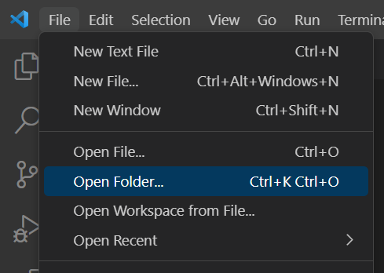

# Introductory Programming in C

The C language has been around since the late 60's although it saw the most development in 1972 and wasn't widely adopted until the late 80's. C is a rather minimal programming language in that it does not include a lot of useful, quality of life features provided by more modern languages. Aside from a few core data types and control flow structures, the C language provides practically nothing else, which makes it an excellent language for learning fundamental concepts as well has how some low-level innards of a program work and operate. We'll be exploring these fundamentals and then building on them to understand how more modern languages work for the convenience of the developer.

### Environment Setup
Let’s start by first creating an environment conducive to programming. I strongly encourage using [Windows Subsystem for Linux](https://learn.microsoft.com/en-us/windows/wsl/install) which you can install following this guide. You should also, if you don’t have it installed already, get [Visual Studio Code](https://code.visualstudio.com/) (Not Visual Studio!). Once you have both installed, open VS Code, and select File > Open Folder



From there, I recommend creating a new folder for these exercises and storing the files there. Once you’ve opened your folder, you should have an empty explorer pane:


You can right click anywhere in there and create a new file. We’re going to call this first one hello_word.c and then inside the file, we’re going to add the following code:


In order to compile and run this program, we’re going to need a terminal available to us. At the top of you VS Code window, select Terminal > New Terminal:


That should open a new window at the bottom of your screen that looks something like so:


From here, select the down arrow next to the + icon and select your WSL option. Mine is Ubuntu WSL, hopefully yours is similar:


This should result in a new prompt that looks like:


At this point, we can compile our application and run it with the following commands:


### Why we did all of that
Now, you may be wondering what the purpose of all of this “hello, world” stuff is. The simple answer is that it is a basic litmus test to ensure that you have all of the resources you need to build and run programs using the C Language. Anytime you set up a project, it should start with a “Hello, world” test because it shows that your system is minimally configured to work with your selected technology stack. This does, of course, get more complicated with bigger projects and build systems, but all of those advanced tools are just wrappers around these simple concepts.

### Breaking down the code
Let’s take a look at the source code and discuss what’s happening on each line


```C
#include <stdio.h> // 1

int main()
{ // 3
    printf("Hello, world!\n"); // 2
    return 0; // 5
} // 3
```
1. This `#include` statement is called a preprocessor macro which we can discuss more in depth later. What it essentially does is copy all of the contents of the “stdio.h” file into this source file. We do this so that we have access to the functions within that file.
2. This is the function declaration. A function is a series of statements (i.e. lines of code) that are grouped together and executed sequentially to perform a set of operations. We’ll discuss functions in more detail later and explain what the `int` `main` and `()` components all mean individually. For now, we’ll call this the main function
3. This section contains the body of the function that we declared in line 3. The body is just the grouping of statements belonging to the main function.
4. Here, we call the `printf` function with the argument “Hello, world!\n”. Normally, we wouldn’t have access to the `printf` function, but if you recall from section 1, we `#include`d the `stdio.h` file which actually contains the definition of this file. This particular function is actually responsible for writing text to the standard output stream of our systems. Typically, this is the monitor or program window that we're looking at.
5. Lastly, we have the statement `return 0;` The keyword `return` tells the program that we are done with this particular function and that we can exit from it. Often, a function will be responsible for returning data to its original calling source which is why we have the 0 tacked on to the end there.

## Variables
Variables can be thought of as little boxes that you can put “stuff” into. In most programming languages, variables have a type assigned to  them so that the programmer always knows what kind of data is stored in a variable. Here is a variable declaration:
```C
int b = 80085;
```
Here, we created a variable called `b` that is of type `int` (which is short for integer) and it contains the number `80085`; We can then print that out using the nifty printf function from the hello world function:
```C
#include <iostream>

int main(){
    int b = 80085;
    printf("Our variable b contains the value: %d\n", b);
    return 0;
}
```

You’ve probably noticed the weird `%d\n` in the printf function. This is called string formatting, and it’s how we print data to the screen that typically isn’t represented as a string. In short, the `%d` stands for "print a number formatted as a decimal" and the `\n` represents "print a new line." There are a lot of other formatting options, but since it’s not the point of what we’re exploring right now, don’t focus too much on it.

When declaring a variable, the format is really easy: select the type, the name, and then the initial value:

`<variable_type> <variable_name> = <initial_value>;`

Here are some examples:
```C
int main(){
    short shortVar = 32767;
    int intVar = 80085;
    long longVar = 9223372036854775807;
    char characterVar = 'e';
}
```

While many of these look like numbers (and they are), they're different kinds of numbers. You can head over and review the (Data Types)[./DataTypes.md] Document to gain an understanding of how they're different.
## Operators
Operators are used to indicate implicit operations on variables. We have Unary and Binary operators which operate on 1 or 2 variables respectively.
### Unary Operators
Unary operators only effect one variable at a time. There are two key unary operators that we have to address: increment and decrement
#### Increment
Increment is used to increase the value of a variable by one. This only applies to numerical (Data Types)[./DataTypes.md]. The increment operator is `++`
```C
int main(){
    int a = 1;
    printf("%d\n", a); // a will be 1
    a++;
    printf("%d\n", a); // a will now be 2
}
```
#### Decrement
Decrement is used to decrease a value by one. This works very similar to the increment operator but the symbol is `--`
```C
int main(){
    int a = 1;
    printf("%d\n", a); // a will be 1
    a--;
    printf("%d\n", a); // a will now be 0
}
```
#### Pre- vs Post- Increment and Decrement Operators
The Increment and Decrement operators are special in that the operator can either come before or after the variable, and the behavior changes slightly depending on where the operator is. If the operator is *before* the variable, then the variable is modified before the parent statement is being executed. If the operator is *after* the variable then the variable is modified *after* the parent statement is completed.
Here's an example showcasing both behaviors:
```C
int main(){
    int a = 5;
    a++; // This isn't a special case, but a will become 6
    printf("The value of a: %d\n", a++); // This will print 6 and then increment to 7xd
    printf("The value of a: %d\n", a); // A will be sevent at this point
    printf("The value of a %d\n", ++a); // This increment first and then print!
    return 0;
}
```

A special case:
```C
int a = 1;
++a++; // whoa
```
This is considered undefined behavior and your program should fail to compile.
### Binary Operators
Binary operators are pretty straightforward, and I'm not going to go into too much detail on them.
- `=`: The Assignment operator is used to store a value in a variable
```C
int x = 5;
int y = x; // y will be assigned the value in x; a.k.a, 5
```
- `<`: The Less than operator implies `x < y --> x is less than y`
- `>`: the Greater than operator implies `x > y --> x is greater than y`
- `<=`: The Less Than or Equal To operator implies `x <= y --> x is less than or equal to y`
- `>=`: The Greater Than or Equal To operator implies `x >= y --> x is greater than or equal to y`
- `==`: The Equality operator implies `x == y --> x equals y`. This should be clearly distinguished from the `=` (assignment) operator described above

## Control Flow
Control flow statements dictate how code executes based on conditions in the code. We'll explore the most common forms of control flow and see how they can be used improve program functionality.
### `if`
```
if(<condition one>){
    // if body
} else if(condition two){
    // else if body
} else {
    // default body
}
```
If statements are the first and simplest control statement available. They allow us to execute a block of code *only* if a condition is true
```C
bool condition = true;
if(condition){
    printf("Our condition was true!\n");
}
```
We can extend the `if` statement as well with `else if` and a terminal `else` clause. This allows us to customize the individual behavior of `if` statements. Here's an extended example:
```C
int number = getRandomNumber(); // Pretend that this produces some random number between 0 and 100.
if(number < 25){
    printf("Number is less than 25");
} else if (number < 50) {
    printf("Number is less than 50");
} else if (number < 75) {
    printf("Number is less than 75");
} else {
    printf("Number is greater than 75");
}
```
Notice that `else if` statements require a condition just like the initial `if` statement. The `else` statement, however, acts as a default statement if no other condition is meant.
### `while`
```
while(<condition>){
    // loop boddy
}
```
The `while` statement is looping control statement. A loop will repeat until a specified condition is met. This example will print the numbers 0-9:
```C
int i = 0;
while(i < 0){
    printf("%d ");
    i = i + 1;
}
printf("\n");
```
### `for`
```
for(<loop variable>; <condition check>; <step statement>){
    // loop body
}
```
The `for` statement is another looping control statement, very similar to the `while` loop. However, it changes the structure to handle a few particular pieces for you. Here's an example that prints 0-9 (just like the while loop!), but in fewer lines of code:
```C
for(int i = 0; i < 10; i++){
    printf("%d ");
}
printf("\n");
```
In theory, you can write any `for` loop as a `while` loop and vice-versa. The `for` and `while` loops have the same expressive power, so the decision to use one over the other comes down to the developers decision and what the cleanest way to express intent is. Now, the `for` loop has a slighty more complex syntax, so let's break it down a little bit

The `for` loop is composed of 3 statements: `for(statement1; statement2; statement3){}`
1. The first statement describes, the condition variable that we are considering within our loop.
2. The second statement describes the condition that the loop depends on. The loop will continue executing until the condition is met
3. The third and last statement is the step or increment variable. This will occur right before the loop restarts again.
In our previous example, our first statement was the creation of the `i` variable which is a common way of counting an `i`ndex.

Our second statement is used to ensure that the loop executes as long as the `i` variable is less than `10`.

Lastly, our step statement increments the `i` variable by 1 (if the `++` syntax is unfamiliar check out the [Operators Guide](./Operators.md))

Loop statements are extremely common, and probably one of the most fundamental flow control statements in use.

### `switch`
`switch` statements are a way to check if a variable matches a specific value. You can represent any `switch` statement as an `if-else` statement, but not necessarily all `if-else` statements can be represented as a `switch` statement. Here's an example:
```C
int var = getRandomNumber(); // Pretend that this produces some random number between 0 and 10.
switch(var){
    case 1:
        printf("The random number was 1");
        break;
    case 2:
        printf("The random number was 2");
        break;
    case 3:
        printf("The random number was 3");
        break;
    default:
        printf("The random number was greater than 3");
        break;
}
```
There are a few things to note here:
- `case`: This indicates a specific condition variable that we might be interested in for our variable. If our variable matches the case value, the code in the body of the `case` operation will be executed.
- `break`: Once you're satisfied with a specific `case` you can terminate the rest of the execution of `switch` statement by using a `break` statement. This will immediately jump to the next statement *after* the `switch` statement
- `default`: If no `break` statement is used prior to checking reach this point, then the `default` clause will be executed
## Organization and Structure
The last thing we will introduce in this topic is the function. A function is a series of statements that can be invoked or called from other parts of your code. This is super handy for reusing the same blocks of code that achieve a specific purpose. Thus far, we've been regularly using two functions: `main` and `printf`. 

The purpose of `printf` is to print a string to your screen.

`main` on the other hand, is a special function. This one serves as the entry point to every program. There can only be one `main` function and every program must have it.

To create your own functions, there are a couple of key things you'll need: a return type, a name, and a series of parameters.
- The return type describes the kind of data that your function will give back to the calling code when the function has completed
- The name is the token by which you will invoke your code from other parts of the code
- The parameter list indicates all of the things that your function requires in order to operate. The parameter list is a comma separated list of variables

Here's a full example of creating and calling our own function:
```C
#include <stdio.h>

int multiplyByFive(int x){
    int result = x * 5;
    return result;
}

int main(){
    int a = multiplyByFive(5); // Here, we call our function with the number 5
    int b = multipleyByFive(a); // This time, we call the function using the value stored in variable a which is currently 25
    printf("Variable a: %d\n", b);
    printf("Variable b: %d\n", b);
}
```

## Exercises:
1. Git Gud